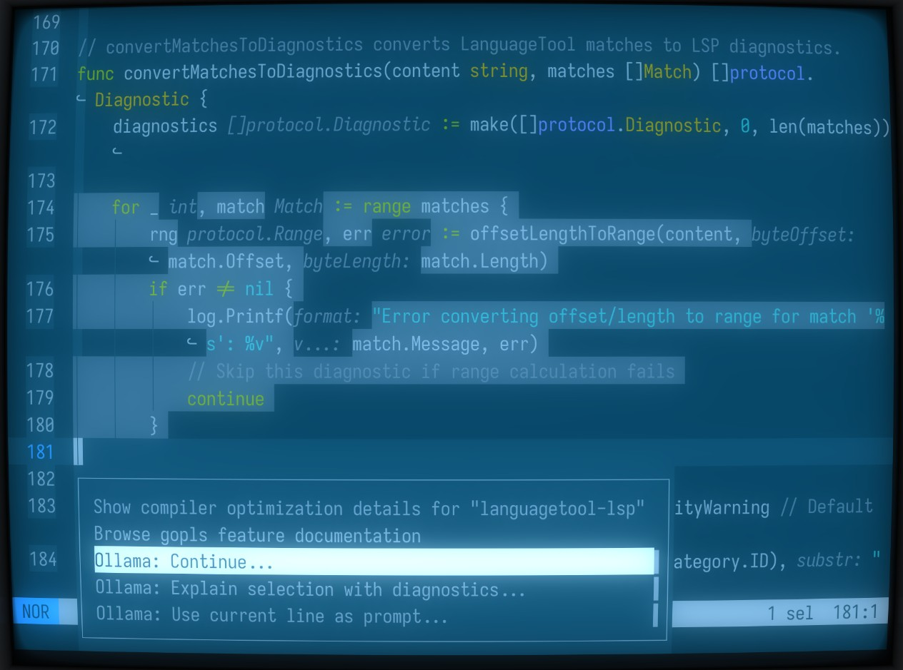
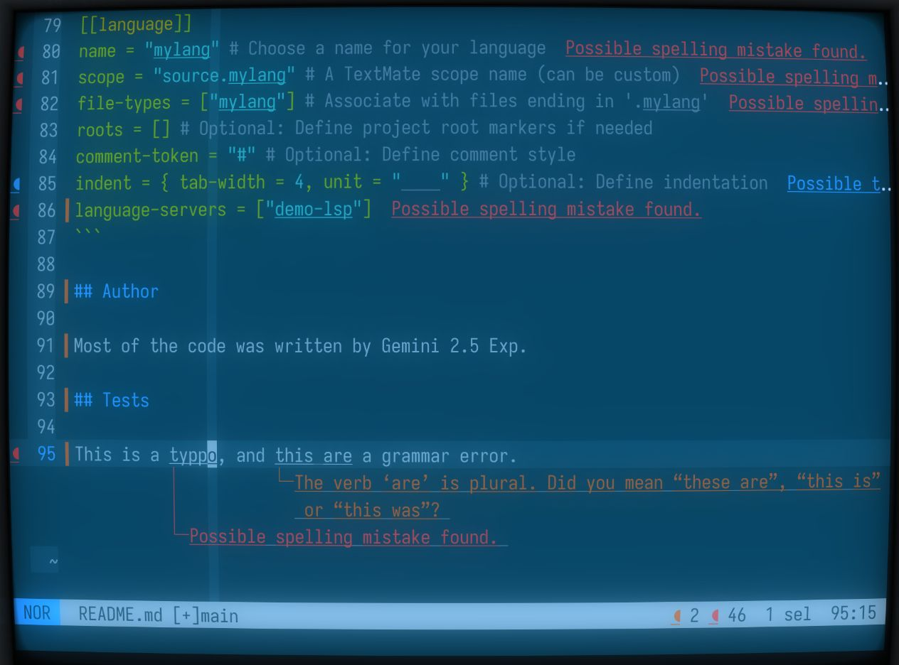

## lspgo

LSPGo contains a library to build language servers.

It contains two working language servers implementations:

*   `ollama-lsp`: A language server for the [Ollama](https://ollama.com/) language model.
    Ollama-LSP can be configured using the `OLLAMA_HOST` and `OLLAMA_MODEL` environment variables.
    It provides three actions:
    - Continue
    - Use the selection as a prompt.
    - Explain the selection.
    
*   `languagetool-lsp`: A language server for the [Languagetool API](https://languagetool.org/dev).
    

## Usage

**1. Build or Install the LSP Servers**

```bash
go build -o ollama-lsp ./cmd/ollama-lsp
go build -o languagetool-lsp ./cmd/languagetool-lsp
```

Or go to the [Github release page](https://github.com/akhenakh/lspgo/releases)

**2. Configure your editor**

The following is an example for [Helix](https://helix-editor.com/) editor, but it works for any editors that support LSPs.

Helix uses a configuration file, typically `languages.toml`, to define how to interact with language servers.

*   **Locate your Helix configuration directory:**
    *   Linux: `~/.config/helix/`
    *   macOS: `~/Library/Application Support/helix/`
    *   Windows: `%AppData%\helix\`
*   **Edit or Create `languages.toml`:** Inside that directory, find or create the `languages.toml` file.

Add boths servers, commands needs to be in your PATH.

```toml
[language-server.ollama-lsp]
command = "ollama-lsp"

[language-server.languagetool-lsp]
command = "languagetool-lsp"
```

To add the ollama-lsp server and associate it with the Go language:
```toml
[language-server.ollama-lsp]
command = "ollama-lsp"

[[language]]
name = "go"
language-servers = ["gopls","ollama-lsp"]
```
In helix you can then trigger the action using `space+a`.

To add the languagetool-lsp server and associate it with the markdown language:

```toml
[language-server.languagetool-lsp]
command = "languagetool-lsp"

[[language]]
name = "markdown"
language-servers = ["languagetool-lsp"]
```

## Using the library

To use the library and implement your own LSP, look at the `cmd/demo-lsp/main.go`.

Register the demo-lsp in your editor:

```toml
[language-server.demo-lsp]
command = "demo-lsp"


[[language]]
name = "mylang" # Choose a name for your language
scope = "source.mylang" # A TextMate scope name (can be custom)
file-types = ["mylang"] # Associate with files ending in '.mylang'
roots = [] # Optional: Define project root markers if needed
comment-token = "#" # Optional: Define comment style
indent = { tab-width = 4, unit = "    " } # Optional: Define indentation
language-servers = ["demo-lsp"]
```

## Author

Most of the code was written by Gemini 2.5 Exp.
